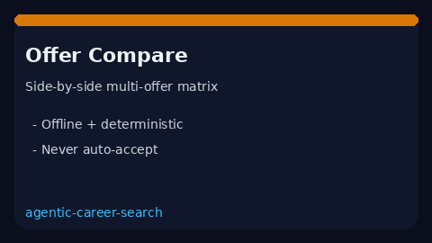

# Offer Compare Matrix Guide



Compare multiple job offers side-by-side with a deterministic
**cash + equity** total heuristic. Offline and assistive only — never
auto-accepts. Closes the gap vs Levels.fyi / Blind comparison UIs that are
browser-bound.

Optional later narrative polish via **GPT-5.5 / Claude Sonnet 4.6 / Gemini 3.x /
Kimi K2**. The ranking itself stays deterministic.

## Why this exists

Levels.fyi and Blind offer UIs are online and UI-bound. This service closes the
gap with a testable offline matrix primitive that ranks offers and always sets
`auto_accept=False`.

## Usage

```python
from autoapply_agent.services.offer_compare import OfferCompareMatrix

result = OfferCompareMatrix().compare(
    [
        {
            "company": "Acme",
            "base": 150_000,
            "bonus": 10_000,
            "equity": 20_000,
            "remote": "hybrid",
            "notes": "good team",
        },
        {
            "company": "Globex",
            "base": 140_000,
            "bonus": 5_000,
            "equity": 80_000,
            "remote": "remote",
            "notes": "",
        },
    ]
)
assert result.auto_accept is False
print(result.summary)
for row in result.rows:
    print(row.rank, row.company, row.total_comp)
```

## Safety

Never auto-accepts. No HTTP. Humans verify vesting, equity refreshers, and
remote policy before deciding. See `SAFETY.md`.
