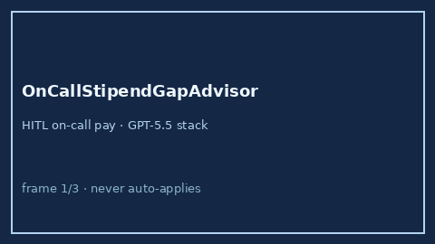

# OnCallStipendGapAdvisor Guide



Offline HITL advisor. Never auto-accepts. Closes closed-UI gaps vs Levels.fyi /
Blind / Candor on-call compensation calculators.

Optional later polish via **GPT-5.5 / Claude Sonnet 4.6 / Gemini 3.x / Kimi K2**.

Distinct from `CommuteCostTradeoffAdvisor` and `PtoCashOutValueAdvisor`.

## Usage

```python
from autoapply_agent.services.oncall_stipend_gap import OnCallStipendGapAdvisor

report = OnCallStipendGapAdvisor().advise(
    weekly_oncall_hours=24.0,
    hourly_oncall_rate=20.0,
    monthly_flat_stipend=200.0,
    expected_pages_per_week=8.0,
)
assert report.auto_accept is False
assert report.requires_human_review is True
print(report.value_band, report.annual_value_usd)
```

## Safety

Always `requires_human_review=True`. No HTTP. Humans decide. See `SAFETY.md`.
