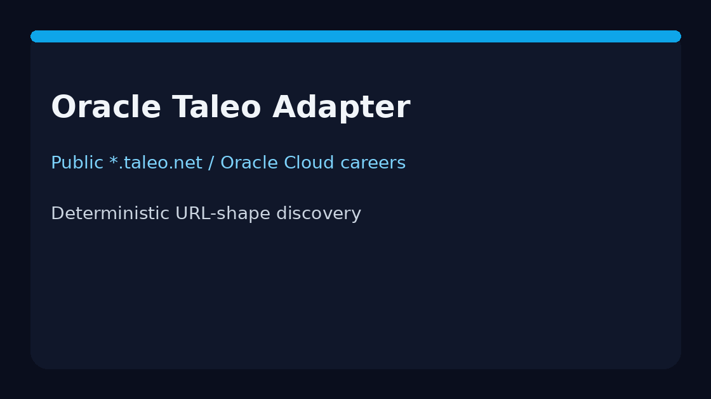

# Oracle Taleo Source Guide



Use this guide when wiring a public Oracle Taleo / Oracle Cloud HCM careers
board into **agentic-career-search**. Discovery is deterministic HTML URL-shape
matching — enrichment with GPT-5.5 / Claude Sonnet 4.6 / Gemini 2.5 / Kimi K2
is optional and runs after candidates are collected.

## Why Oracle Taleo

Enterprise career sites still commonly run on Taleo (`*.taleo.net`) or Oracle
Cloud Recruiting. Unlike Greenhouse boards, postings are linked by requisition
ids in query strings or path segments rather than a single CSS class. This
adapter mirrors the iCIMS/Jobvite approach used by popular ATS scrapers.

## Register a source

```bash
curl -X POST localhost:8000/source-configs \
  -H 'content-type: application/json' \
  -d '{
    "name": "acme-taleo",
    "source_type": "oracle_taleo",
    "base_url": "https://acme.taleo.net/careersection/ex/jobsearch.ftl"
  }'
```

Any public listing URL works. The adapter extracts postings from:

| Shape | Example |
|---|---|
| Query requisition | `/careersection/ex/jobdetail.ftl?job=123456` |
| Path `/jobs/{id}` | `/jobs/JR-7788` |
| Path `/job/{id}` | `/job/1001` |

Apply steps (`mode=apply`, trailing `apply`/`login`) are ignored.

## What you get

| Field | Source |
|---|---|
| `title` | Anchor text, else `title` attribute |
| `location` | Nearest posting-container location text |
| `external_id` | `job` / `jobId` query value or terminal path id |
| `url` | Absolute posting URL |
| `company` | Host-derived token |

## Safety notes

- Public careers pages only — no authenticated Taleo/HCM APIs.
- Outbound User-Agent comes from settings.
- Parsing stops at `max_jobs`; no unbounded crawl.

See ADR-089 for the design decision.
