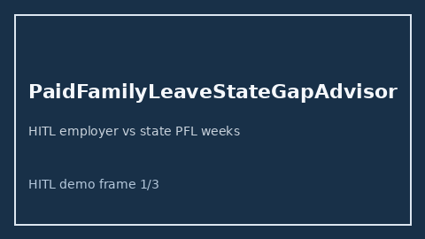

# PaidFamilyLeaveStateGapAdvisor Guide



Offline HITL advisor. Never auto-acts. Closes closed-UI gaps vs Rippling/Gusto/Levels.fyi paid-family-leave state-mandate planners.

Optional later polish via **GPT-5.5 / Claude Sonnet 4.6 / Gemini 3.x / Kimi K2**.

Distinct from `BereavementLeaveGapAdvisor` and `BackupCareDaysGapAdvisor`.

## Usage

```python
from autoapply_agent.services.paid_family_leave_state_gap import PaidFamilyLeaveStateGapAdvisor

report = PaidFamilyLeaveStateGapAdvisor().advise(
    employer_weeks=12.0,
    state_mandated_weeks=8.0,
)
assert report.auto_enroll is False
print(report.coverage_band)
```

## Safety

Always `requires_human_review=True`. No HTTP. Humans decide. See `SAFETY.md`.
