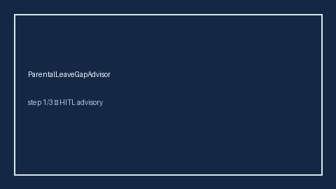

        # ParentalLeaveGapAdvisor Guide

        

        Offline HITL advisor. Never auto-acts. Closes closed-UI gaps vs popular
        career tools.

        Optional later polish via **GPT-5.5 / Claude Sonnet 4.6 / Gemini 3.x / Kimi K2**.

        Distinct from `SeverancePackageGapAdvisor` and `RelocationPackageGapAdvisor`.

        ## Usage

        ```python
from autoapply_agent.services.parental_leave_gap import ParentalLeaveGapAdvisor

report = ParentalLeaveGapAdvisor().advise(
    offered_weeks=8.0,
    market_weeks=12.0,
)
assert report.auto_accept is False
assert report.requires_human_review is True
print(report.coverage_band, report.coverage_ratio)
```


        ## Safety

        Always `requires_human_review=True`. No HTTP. Humans decide. See `SAFETY.md`.
