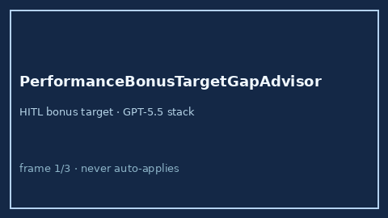

# PerformanceBonusTargetGapAdvisor Guide



Offline HITL advisor. Never auto-accepts. Closes closed-UI gaps vs Levels.fyi /
Candor / Blind target-bonus calculators.

Optional later polish via **GPT-5.5 / Claude Sonnet 4.6 / Gemini 3.x / Kimi K2**.

Distinct from `SalaryBandAdvisor` and `FourOhOneKMatchGapAdvisor`.

## Usage

```python
from autoapply_agent.services.performance_bonus_target_gap import (
    PerformanceBonusTargetGapAdvisor,
)

report = PerformanceBonusTargetGapAdvisor().advise(
    offered_target_pct=10.0,
    market_target_pct=15.0,
)
assert report.auto_accept is False
assert report.requires_human_review is True
print(report.gap_band, report.gap_pct_points)
```

## Safety

Always `requires_human_review=True`. No HTTP. Humans decide. See `SAFETY.md`.
