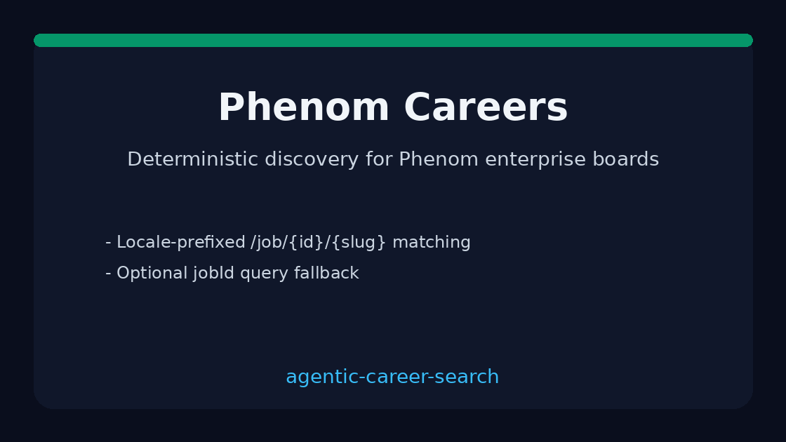

# Phenom Source Guide



Use this guide when wiring a public Phenom careers board into
**agentic-career-search**. Discovery is deterministic HTML URL-shape matching —
enrichment with GPT-5.5 / Claude Sonnet 4.6 / Gemini 2.5 / Kimi K2 is optional
and runs after candidates are collected.

## Why Phenom

Enterprise career sites commonly run on Phenom (`*.phenompeople.com` or a
vanity domain fronting Phenom). Postings are linked by requisition ids under
locale-prefixed `/job/{id}` paths rather than a single CSS class. This adapter
mirrors the iCIMS/Jobvite/SuccessFactors approach used by popular ATS scrapers.

## Register a source

```bash
curl -X POST localhost:8000/source-configs \
  -H 'content-type: application/json' \
  -d '{
    "name": "acme-phenom",
    "source_type": "phenom",
    "base_url": "https://careers.acme.phenompeople.com/us/en/search-results"
  }'
```

Any public listing URL works. The adapter extracts postings from:

| Shape | Example |
|---|---|
| Locale + slug | `/us/en/job/1234567/platform-engineer` |
| Locale + id | `/en-US/job/JR-7788` |
| Path `/jobs/{id}` | `/jobs/9001` |
| Query `jobId` | `/job?jobId=1234567` |

Apply steps (`/apply`, `mode=apply`) and `/jobs/search` grids are ignored.

## What you get

| Field | Source |
|---|---|
| `title` | Anchor text, else `title` attribute |
| `location` | Nearest posting-container location text |
| `external_id` | Path id after `job`/`jobs`, or `jobId` query value |
| `url` | Absolute posting URL |
| `company` | Host-derived token |

## Safety notes

- Public careers pages only — no authenticated Phenom APIs.
- Outbound User-Agent comes from settings.
- Parsing stops at `max_jobs`; no unbounded crawl.

See ADR-091 for the design decision.
