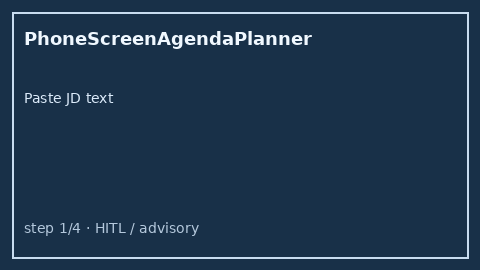

# Phone Screen Agenda Planner Guide



Build an offline phone-screen agenda from JD cues. Never auto-books calendars.
Closes the Interviewing.io / Exponent / Teal phone-screen prep gap.

Optional later polish via **GPT-5.5 / Claude Sonnet 4.6 / Gemini 3.x / Kimi K2**.

Distinct from `InterviewPrepBriefService` and `InterviewScheduleConflictGuard`.

## Usage

```python
from autoapply_agent.services.phone_screen_agenda import PhoneScreenAgendaPlanner

plan = PhoneScreenAgendaPlanner().plan(
    "You will own Python services on AWS with cross-functional stakeholders."
)
assert plan.requires_human_review is True
assert plan.auto_book is False
print([(i.topic, i.minutes) for i in plan.items])
```

## Safety

Always `requires_human_review=True` and `auto_book=False`. No HTTP. Humans book
and run screens. See `SAFETY.md`.
