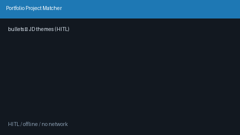

# Portfolio Project Matcher Guide



Map **portfolio bullet strings → JD theme keywords** with deterministic offline
token overlap. Always requires human review. Closes the gap vs Teal/Jobscan
portfolio↔JD mapping UIs that leave candidates to hand-align project bullets.

Distinct from `AtsKeywordCoverageScorer` (resume free text ↔ JD keywords) and
`SkillsProfileFitScorer` (skills list ↔ job tokens).

Optional later polish via **GPT-5.5 / Claude Sonnet 4.6 / Gemini 3.x / Kimi K2**.
The matcher itself stays deterministic and performs no network I/O.

## Why this exists

Teal and Jobscan help surface portfolio↔JD alignment in a product UI, but few
open-source career agents expose a local, library-style theme matcher for
agentic triage. This service always sets `requires_human_review=True` and never
rewrites or auto-submits portfolio content.

## Usage

```python
from autoapply_agent.services.portfolio_matcher import PortfolioProjectMatcher

results = PortfolioProjectMatcher().match(
    portfolio_bullets=[
        "Built a FastAPI service on Kubernetes",
        "Designed a React dashboard for analytics",
    ],
    jd_themes=["kubernetes orchestration", "react frontend", "golang"],
)
for item in results:
    assert item.requires_human_review is True
    print(item.jd_theme, item.score, item.matched_bullets)
```

`score` is in `[0.0, 1.0]` — the best per-theme token-overlap fraction across
matching bullets (`|theme ∩ bullet| / |theme|`).

## Distinct from other fit scorers

| Scorer | Input | Match style |
|---|---|---|
| `SkillsProfileFitScorer` | Candidate skills **list** | Each skill token in JD |
| `AtsKeywordCoverageScorer` | Free-form **resume text** | JD keywords present in resume |
| `PortfolioProjectMatcher` | Portfolio **bullets** + JD **themes** | Theme↔bullet token overlap |

## Safety

Always `requires_human_review=True`. No HTTP. Humans decide which bullets to
surface in applications. See `SAFETY.md`.
