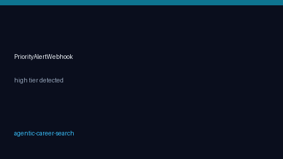

# Priority Alert Webhook Guide



Use this guide to notify Slack, Discord, or a custom endpoint whenever the
agent marks a posting as **high** priority. Alerts are fail-soft: webhook
errors are logged and never fail the run.

Optional LLM polish of alert copy can later use GPT-5.5 / Claude Sonnet 4.6 /
Gemini 3.x / Kimi K2 — the webhook payload itself stays deterministic JSON.

## Why this exists

Tools like Teal and Simplify surface “must-apply” roles in a UI inbox; JobSpy
scrapes boards but has no priority webhook; OpenHands-style agents can act but
rarely expose a durable, fail-soft alert channel for triage. This helper fills
that gap for autonomous career-search runs.

## Configure

```env
PRIORITY_ALERT_WEBHOOK_ENABLED=true
PRIORITY_ALERT_WEBHOOK_URL=https://hooks.example.com/services/...
PRIORITY_ALERT_WEBHOOK_TIMEOUT_SECONDS=5.0
```

See `.env.example` and `CONFIGURATION.md`.

## Call the helper

```python
from autoapply_agent.services.alerting import send_priority_alert_async

await send_priority_alert_async(
    priority_tier="high",
    run_id=str(run.id),
    job_title=job_candidate.title,
    job_url=job_candidate.url,
    company=job_candidate.company,
    score=decision.score,
)
```

Sync variant: `send_priority_alert(...)`.

Only `priority_tier == "high"` posts. Medium/low tiers and disabled flags are
no-ops. Worker wiring is optional — call the helper after `agent.decision`
events when you want live notifications.

## Payload shape

```json
{
  "event": "priority.alert",
  "priority_tier": "high",
  "run_id": "...",
  "job_title": "...",
  "job_url": "...",
  "company": "...",
  "score": 0.91
}
```

## Safety notes

- Webhook POST only; no auto-apply or credential submission.
- Fail-soft: transport/HTTP errors return `False` and log a warning.
- Keep webhook URLs in `.env`, never in source configs committed to git.
