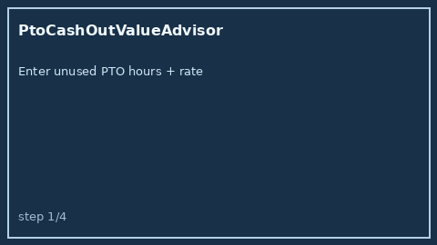

# PtoCashOutValueAdvisor Guide



Offline HITL advisor. Never auto-cashes. Closes closed-UI gaps vs Rippling /
Gusto / Candor PTO payout calculators.

Optional later polish via **GPT-5.5 / Claude Sonnet 4.6 / Gemini 3.x / Kimi K2**.

Distinct from `SeverancePackageGapAdvisor` and `ParentalLeaveGapAdvisor`.

## Usage

```python
from autoapply_agent.services.pto_cash_out_value import PtoCashOutValueAdvisor

report = PtoCashOutValueAdvisor().advise(
    unused_pto_hours=80.0,
    hourly_rate=50.0,
)
assert report.auto_cash is False
assert report.requires_human_review is True
print(report.value_band, report.cash_out_usd)
```

## Safety

Always `requires_human_review=True`. No HTTP. Humans decide. See `SAFETY.md`.
