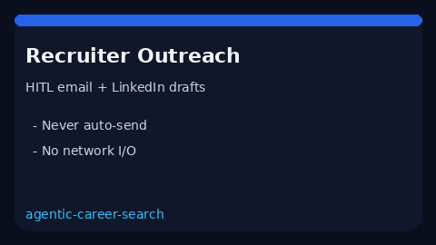

# Recruiter Outreach Draft Guide



Generate deterministic, offline **email** and **LinkedIn DM** outreach drafts
for human review. Never auto-sends. Closes the gap vs Teal/Huntr templates and
LinkedIn Easy Apply flows that fire messages without a HITL gate.

Optional later polish via **GPT-5.5 / Claude Sonnet 4.6 / Gemini 3.x / Kimi K2**.
The draft itself stays deterministic.

## Why this exists

Teal and Huntr provide UI templates; LinkedIn Easy Apply can auto-send. This
service closes the gap with a testable HITL draft primitive that always sets
`requires_human_review=True` and performs no network I/O.

## Usage

```python
from autoapply_agent.services.recruiter_outreach import RecruiterOutreachDraftService

draft = RecruiterOutreachDraftService().generate(
    company="Nimbus",
    role="ML Engineer",
    recruiter_name="Alex",
    channel="email",
    notes="Shipped retrieval ranking in prod",
)
assert draft.requires_human_review is True
print(draft.subject)
print(draft.body)
print(draft.talking_points)
```

Supported channels: `email`, `linkedin`.

## Safety

Always `requires_human_review=True`. No HTTP. Humans edit and send manually.
See `SAFETY.md`.
