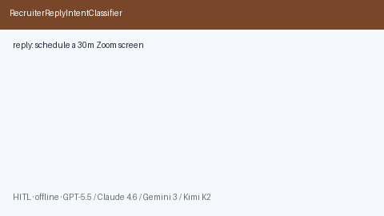

# Recruiter Reply Intent Classifier Guide



Classify offline recruiter replies into interested / scheduling / rejection /
nurture intents. Never auto-sends. Closes the Teal / Huntr / Superhuman inbox
labeling gap.

Optional later polish via **GPT-5.5 / Claude Sonnet 4.6 / Gemini 3.x / Kimi K2**.

Distinct from `RecruiterOutreachDraftService` and `ApplicationFollowUpCadencePlanner`.

## Usage

```python
from autoapply_agent.services.reply_intent import RecruiterReplyIntentClassifier

report = RecruiterReplyIntentClassifier().classify(
    "Happy to schedule a 30 minutes Zoom phone screen — send availability."
)
assert report.requires_human_review is True
assert report.auto_send is False
print([i.intent for i in report.intents])
```

## Safety

Always `requires_human_review=True` and `auto_send=False`. No HTTP. Humans send
replies. See `SAFETY.md`.
