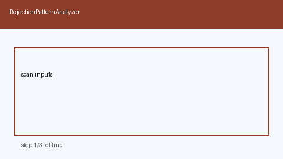

# Rejection Pattern Analyzer Guide



Cluster deterministic, offline **rejection reasons** into coarse themes with
HITL next actions. Never auto-rewrites resumes. Closes the gap vs Teal Insights /
Huntr analytics locked inside proprietary dashboards.

Optional later polish via **GPT-5.5 / Claude Sonnet 4.6 / Gemini 3.x / Kimi K2**.
Clustering itself stays deterministic.

Distinct from `SkillGapLearningPathPlanner` (skill milestones) and
`AtsKeywordCoverageScorer` (keyword coverage).

## Usage

```python
from autoapply_agent.services.rejection_pattern import RejectionPatternAnalyzer

report = RejectionPatternAnalyzer().analyze(
    [
        "Need more senior experience",
        "Missing Kubernetes skills",
        "Role filled by another candidate",
    ]
)
assert report.requires_human_review is True
assert report.auto_rewrite is False
print(report.themes)
```

## Safety

Always `requires_human_review=True` and `auto_rewrite=False`. No HTTP. Humans
decide whether to change materials. See `SAFETY.md`.
