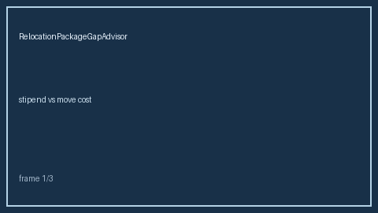

# Relocation Package Gap Advisor Guide



Compare offered relocation stipend vs estimated move cost. Never auto-accepts.
Closes the Huntr / Teal / Levels.fyi relocation-coverage gap.

Optional later polish via **GPT-5.5 / Claude Sonnet 4.6 / Gemini 3.x / Kimi K2**.

Distinct from `LocationRemoteFitScorer` and `OfferCompareMatrix`.

## Usage

```python
from autoapply_agent.services.relocation_package_gap import RelocationPackageGapAdvisor

report = RelocationPackageGapAdvisor().advise(
    offered_stipend=5_000.0,
    estimated_move_cost=10_000.0,
)
assert report.auto_accept is False
print(report.coverage_band, report.gap_amount)
```

## Safety

Always `requires_human_review=True` and `auto_accept=False`. No HTTP. See `SAFETY.md`.
