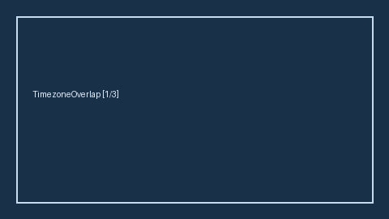

# Remote Timezone Overlap Advisor Guide



Compute weekday overlap hours between a candidate UTC offset and a team core
window. Never auto-applies. Closes the RemoteOK / FlexJobs / We Work Remotely
timezone-filter gap.

Optional later polish via **GPT-5.5 / Claude Sonnet 4.6 / Gemini 3.x / Kimi K2**.

Distinct from `LocationRemoteFitScorer` and `InterviewScheduleConflictGuard`.

## Usage

```python
from autoapply_agent.services.timezone_overlap import RemoteTimezoneOverlapAdvisor

report = RemoteTimezoneOverlapAdvisor().advise(
    candidate_utc_offset_hours=-8.0,
    team_utc_offset_hours=-5.0,
)
assert report.auto_apply is False
assert report.requires_human_review is True
print(report.overlap_band, report.overlap_hours)
```

## Safety

Always `requires_human_review=True` and `auto_apply=False`. No HTTP. Humans
decide remote fit. See `SAFETY.md`.
