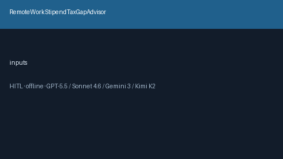

# RemoteWorkStipendTaxGapAdvisor Guide



Offline HITL advisor. Never auto-acts. Closes closed-UI gaps vs Rippling/Gusto/Levels.fyi remote-stipend tax planners.

Optional later polish via **GPT-5.5 / Claude Sonnet 4.6 / Gemini 3.x / Kimi K2**.

Distinct from `HomeOfficeStipendGapAdvisor and WellnessStipendGapAdvisor`.

## Usage

```python
from autoapply_agent.services.remote_work_stipend_tax_gap import RemoteWorkStipendTaxGapAdvisor

report = RemoteWorkStipendTaxGapAdvisor().advise(
    annual_stipend_usd=2000.0,
    estimated_tax_usd=400.0,
    planned_net_usd=1500.0,
)
assert report.auto_enroll is False
assert report.requires_human_review is True
print(report.coverage_band)
```

## Safety

Always `requires_human_review=True`. No HTTP. Humans decide. See `SAFETY.md`.
