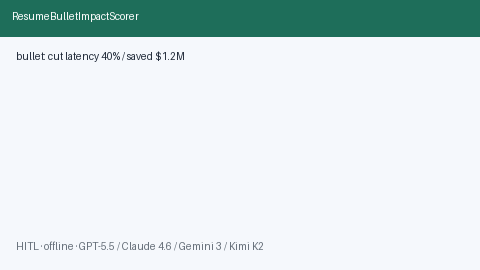

# Resume Bullet Impact Scorer Guide



Score offline resume bullets for quantified impact (%, $, multipliers, scale).
Never auto-rewrites. Closes the Teal Insights / Jobscan / Resume Worded gap
where impact scoring is locked in proprietary UIs.

Optional later polish via **GPT-5.5 / Claude Sonnet 4.6 / Gemini 3.x / Kimi K2**.
Scoring stays deterministic.

Distinct from `AtsKeywordCoverageScorer` and `RejectionPatternAnalyzer`.

## Usage

```python
from autoapply_agent.services.bullet_impact import ResumeBulletImpactScorer

report = ResumeBulletImpactScorer().score(
    ["Led migration that cut latency 40% and saved $1.2M for 2M users."]
)
assert report.requires_human_review is True
assert report.auto_rewrite is False
print(report.bullets_scored[0].band)
```

## Safety

Always `requires_human_review=True` and `auto_rewrite=False`. No HTTP. Humans
edit bullets. See `SAFETY.md`.
