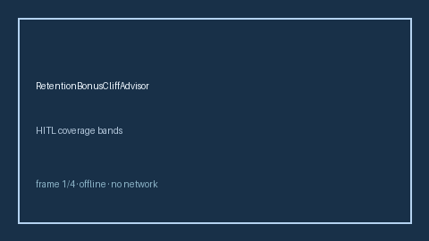

# RetentionBonusCliffAdvisor Guide



Offline HITL advisor. Never auto-acts. Closes closed-UI gaps vs Levels.fyi/Blind/Rippling retention-bonus cliff planners.

Optional later polish via **GPT-5.5 / Claude Sonnet 4.6 / Gemini 3.x / Kimi K2**.

Distinct from `SigningBonusClawbackAdvisor` and `ChangeOfControlAccelerationAdvisor`.

## Usage

```python
from autoapply_agent.services.retention_bonus_cliff import RetentionBonusCliffAdvisor

report = RetentionBonusCliffAdvisor().advise(
    months_to_cliff=80.0,
    target_buffer_months=50.0,
)
assert report.auto_enroll is False
print(report.coverage_band)
```

## Safety

Always `requires_human_review=True`. No HTTP. Humans decide. See `SAFETY.md`.
