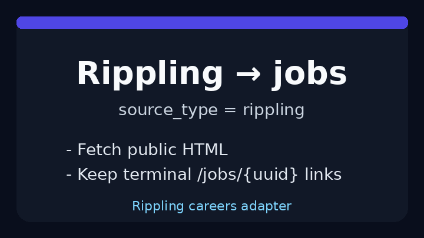

# Rippling Source Guide



Use this guide when wiring a public Rippling careers board into
**agentic-career-search**. Discovery is deterministic HTML URL-shape matching -
enrichment with GPT-5.5 / Claude Sonnet 4.6 / Gemini 3.x / Kimi K2 is optional
and runs after candidates are collected.

## Why Rippling

Rippling public job boards commonly expose open roles at
`ats.rippling.com/{company}/jobs`, with posting detail pages under
`/jobs/{uuid}`. Some branded careers pages on `www.rippling.com` link into that
ATS host. The adapter mirrors the BreezyHR/Freshteam conservative
URL-shape approach: it inspects links already present in the public HTML and
keeps only Rippling posting detail URLs.

## Register a source

```bash
curl -X POST localhost:8000/source-configs \
  -H 'content-type: application/json' \
  -d '{
    "name": "acme-rippling",
    "source_type": "rippling",
    "base_url": "https://ats.rippling.com/acme/jobs"
  }'
```

Use the public listing URL for the tenant when available. The adapter extracts
postings from:

| Shape | Example |
|---|---|
| Tenant board detail | `/acme/jobs/5b74a69a-2353-4812-bd7d-ecc8b73c23ee` |
| Absolute ATS detail | `https://ats.rippling.com/acme/jobs/75804d93-747e-41e4-89fc-26d7c16026bb?jobSite=LinkedIn` |
| Branded Rippling detail | `https://www.rippling.com/jobs/5b74a69a-2353-4812-bd7d-ecc8b73c23ee` |

The board index (`/jobs`), application subpaths (`/jobs/{uuid}/apply`), generic
careers navigation, and absolute links outside `rippling.com` are ignored.

## What you get

| Field | Source |
|---|---|
| `title` | Anchor text, else `title` / `aria-label` / `data-title` |
| `location` | Nearest posting-container location text |
| `external_id` | Terminal `/jobs/{uuid}` token |
| `url` | Absolute posting URL |
| `company` | Host-derived token |

## Safety notes

- Public careers pages only - no authenticated Rippling APIs.
- Outbound User-Agent comes from settings.
- Parsing stops at `max_jobs`; no unbounded crawl.
- Absolute posting links must be on `rippling.com` or a subdomain such as
  `ats.rippling.com`.

See ADR-096 for the design decision.
