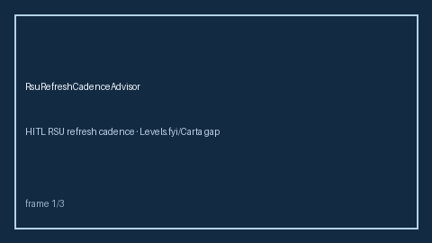

# RSU Refresh Cadence Advisor Guide



Estimate RSU refresh urgency from years since last grant and annual target.
Never auto-accepts. Closes the Levels.fyi / Carta / Candor refresh planner gap.

Optional later polish via **GPT-5.5 / Claude Sonnet 4.6 / Gemini 3.x / Kimi K2**.

Distinct from `EquityVestingCliffAdvisor` and `SigningBonusClawbackAdvisor`.

## Usage

```python
from autoapply_agent.services.rsu_refresh_cadence import RsuRefreshCadenceAdvisor

report = RsuRefreshCadenceAdvisor().advise(
    annual_refresh_value=40_000.0,
    years_since_refresh=1.5,
)
assert report.auto_accept is False
assert report.requires_human_review is True
print(report.cadence_band, report.accrued_value)
```

## Safety

Always `requires_human_review=True` and `auto_accept=False`. No HTTP. Humans
decide equity negotiations. See `SAFETY.md`.
