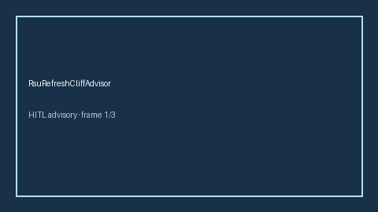

# RsuRefreshCliffAdvisor Guide



Offline HITL advisor. Never auto-acts. Closes closed-UI gaps vs Carta/Pulley/Levels.fyi RSU refresh-cliff planners (distinct from refresh cadence).

Optional later polish via **GPT-5.5 / Claude Sonnet 4.6 / Gemini 3.x / Kimi K2**.

Distinct from `RsuRefreshCadenceAdvisor` and `EquityVestingAdvisor`.

## Usage

```python
from autoapply_agent.services.rsu_refresh_cliff import RsuRefreshCliffAdvisor

report = RsuRefreshCliffAdvisor().advise(
    months_to_refresh_cliff=8.0,
    target_buffer_months=6.0,
)
assert report.auto_enroll is False
print(report.coverage_band)
```

## Safety

Always `requires_human_review=True`. No HTTP. Humans decide. See `SAFETY.md`.
