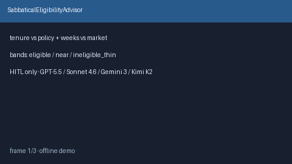

# SabbaticalEligibilityAdvisor Guide



Offline HITL advisor. Never auto-approves. Closes closed-UI gaps vs Levels.fyi /
Blind / Candor sabbatical planners.

Optional later polish via **GPT-5.5 / Claude Sonnet 4.6 / Gemini 3.x / Kimi K2**.

Distinct from `ParentalLeaveGapAdvisor` and `PtoCashOutValueAdvisor`.

## Usage

```python
from autoapply_agent.services.sabbatical_eligibility import SabbaticalEligibilityAdvisor

report = SabbaticalEligibilityAdvisor().advise(
    tenure_years=4.2,
    policy_years=5.0,
    sabbatical_weeks_offered=4,
    market_weeks=6,
)
assert report.auto_approve is False
assert report.requires_human_review is True
print(report.eligibility_band, report.tenure_ratio)
```

## Safety

Always `requires_human_review=True`. No HTTP. Humans decide. See `SAFETY.md`.
