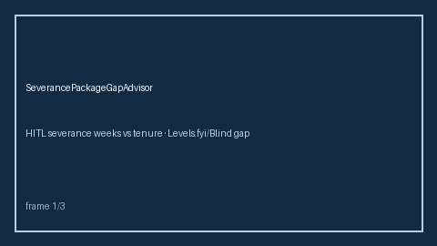

# Severance Package Gap Advisor Guide



Compare offered severance weeks against a tenure-scaled expectation heuristic.
Never auto-accepts. Closes the Levels.fyi / Blind / Candor severance calculator
gap.

Optional later polish via **GPT-5.5 / Claude Sonnet 4.6 / Gemini 3.x / Kimi K2**.

Distinct from `SigningBonusClawbackAdvisor` and `OfferCompareMatrix`.

## Usage

```python
from autoapply_agent.services.severance_package_gap import SeverancePackageGapAdvisor

report = SeverancePackageGapAdvisor().advise(
    tenure_years=5.0,
    offered_weeks=6.0,
)
assert report.auto_accept is False
assert report.requires_human_review is True
print(report.coverage_band, report.coverage_ratio)
```

## Safety

Always `requires_human_review=True` and `auto_accept=False`. No HTTP. Humans
decide acceptance of separation terms. See `SAFETY.md`.
