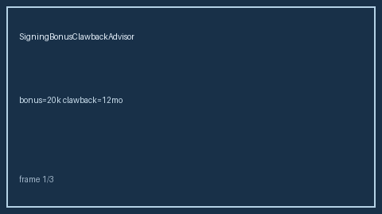

# Signing Bonus Clawback Advisor Guide



Compute remaining clawback liability for a signing bonus under linear monthly
burn-down. Never auto-accepts. Closes the Levels.fyi / Candor / Blind
signing-bonus clawback calculator gap.

Optional later polish via **GPT-5.5 / Claude Sonnet 4.6 / Gemini 3.x / Kimi K2**.

Distinct from `EquityVestingCliffAdvisor` and `OfferDeadlineTracker`.

## Usage

```python
from autoapply_agent.services.signing_bonus_clawback import SigningBonusClawbackAdvisor

report = SigningBonusClawbackAdvisor().advise(
    bonus_amount=20_000.0,
    clawback_months=12,
    months_elapsed=3,
)
assert report.auto_accept is False
assert report.requires_human_review is True
print(report.clawback_band, report.remaining_liability)
```

## Safety

Always `requires_human_review=True` and `auto_accept=False`. No HTTP. Humans
decide offer acceptance. See `SAFETY.md`.
