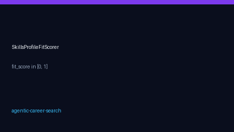

# Skills Profile Fit Scorer Guide



Score how well a candidate's skill list matches a job posting. The helper is a
**pure function** (no database) that returns `fit_score` in `[0.0, 1.0]` plus
matched / missing skills. Matching is case-insensitive.

Optional LLM skill extraction/normalization can later use GPT-5.5 /
Claude Sonnet 4.6 / Gemini 3.x / Kimi K2. The scorer itself stays deterministic.

## Why this exists

Teal and Simplify show keyword overlap in a UI, but not as a reusable library
API inside an agent loop. JobSpy returns postings without profile-fit scoring.
OpenHands agents can reason about fit ad hoc, but lack a stable, testable
skills-fit primitive. This scorer closes that gap for autonomous triage.

## Usage

```python
from autoapply_agent.services.skills_fit import SkillsProfileFitScorer, score_skills_fit

result = score_skills_fit(
    ["Python", "Kubernetes", "SQL"],
    "Senior Python engineer with SQL and cloud experience",
)
print(result.fit_score)  # e.g. 0.6667
print(result.matched_skills)  # ["Python", "SQL"]
print(result.missing_skills)  # ["Kubernetes"]

# Service-style wrapper (same result)
scorer = SkillsProfileFitScorer()
assert scorer.score(["Python"], "python developer") == score_skills_fit(
    ["Python"], "python developer"
)
```

## Optional DeterministicScoringService hook

Call `score_skills_fit` alongside existing relevance scoring when a candidate
profile is available. v1 keeps the scorer standalone so it stays mergeable
without changing the decision engine contract.

## Edge cases

| Input | Result |
|---|---|
| Empty / `None` skills | `fit_score=0.0`, empty matched/missing |
| Partial overlap | Fractional score; split matched/missing |
| Full overlap | `fit_score=1.0` |
| Mixed case | Case-insensitive match |

See `SAFETY.md` — scoring is assistive triage, not automatic apply.
