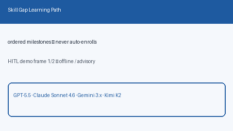

# Skill Gap Learning Path Planner Guide



Generate deterministic, offline **ordered learning milestones** from
`have_skills` vs `required_skills`. Never enrolls courses. Closes the gap vs
Teal/Simplify skill dashboards that keep learning plans inside proprietary UIs.

Optional later polish via **GPT-5.5 / Claude Sonnet 4.6 / Gemini 3.x / Kimi K2**.
The milestone ordering itself stays deterministic.

Distinct from `SkillsProfileFitScorer` (fit scoring only — no learning path).

## Why this exists

Knowing a skill is missing is not the same as having a HITL practice path.
Closed career UIs bury learning plans. This service always sets
`requires_human_review=True`, keeps `auto_enroll=False`, and performs no
network I/O.

## Usage

```python
from autoapply_agent.services.skill_gap_learning import SkillGapLearningPathPlanner

path = SkillGapLearningPathPlanner().plan(
    have_skills=["Python", "SQL"],
    required_skills=["python", "kubernetes", "system design"],
    role="Backend Engineer",
)
assert path.requires_human_review is True
assert path.auto_enroll is False
print(path.missing_skills)
print(path.milestones)
```

## Safety

Always `requires_human_review=True` and `auto_enroll=False`. No HTTP. Humans
choose courses and practice resources. See `SAFETY.md`.
