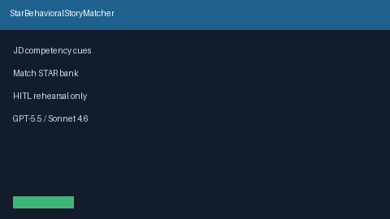

# STAR Behavioral Story Matcher Guide



Match a local STAR story bank to JD competency cues. Never auto-sends answers.
Closes the Interviewing.io / Exponent / Teal behavioral-bank gap.

Optional later polish via **GPT-5.5 / Claude Sonnet 4.6 / Gemini 3.x / Kimi K2**.

Distinct from `InterviewPrepBriefService` and `PhoneScreenAgendaPlanner`.

## Usage

```python
from autoapply_agent.services.star_story import StarBehavioralStoryMatcher, StarStory

stories = [
    StarStory(
        story_id="s1",
        situation="Missed milestone",
        task="Restore delivery",
        action="Mentored engineers and drove stakeholder sync",
        result="Shipped on time",
        tags=("leadership",),
    )
]
plan = StarBehavioralStoryMatcher().match(
    "Lead a cross-functional squad and mentor engineers.",
    stories,
)
assert plan.requires_human_review is True
assert plan.auto_send is False
print([(m.story_id, m.competency, m.score) for m in plan.matches])
```

## Safety

Always `requires_human_review=True` and `auto_send=False`. No HTTP. Humans
rehearse and answer live. See `SAFETY.md`.
