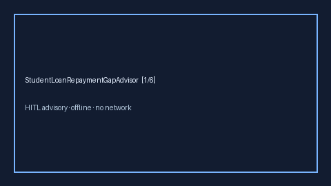

# StudentLoanRepaymentGapAdvisor Guide



Offline HITL advisor. Never auto-enrolls. Closes closed-UI gaps vs Student Loan
Hero / Rippling / Levels.fyi employer SLPRP planners.

Optional later polish via **GPT-5.5 / Claude Sonnet 4.6 / Gemini 3.x / Kimi K2**.

Distinct from `TuitionReimbursementGapAdvisor` and `FourOhOneKMatchGapAdvisor`.

## Usage

```python
from autoapply_agent.services.student_loan_repayment_gap import (
    StudentLoanRepaymentGapAdvisor,
)

report = StudentLoanRepaymentGapAdvisor().advise(
    monthly_payment_usd=500.0,
    employer_monthly_usd=200.0,
    months_remaining=60.0,
)
assert report.auto_enroll is False
assert report.requires_human_review is True
print(report.coverage_band, report.uncovered_monthly_usd)
```

## Safety

Always `requires_human_review=True`. No HTTP. Humans decide. See `SAFETY.md`.
