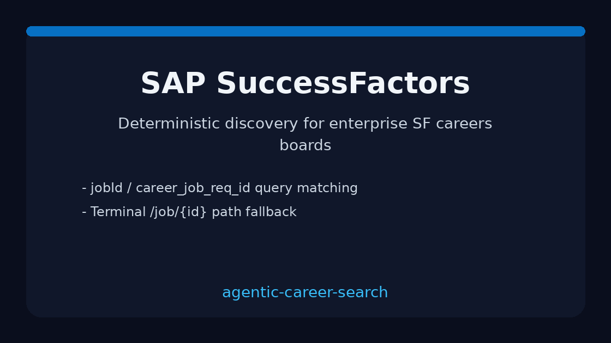

# SAP SuccessFactors Source Guide



Use this guide when wiring a public SAP SuccessFactors careers board into
**agentic-career-search**. Discovery is deterministic HTML URL-shape matching —
enrichment with GPT-5.5 / Claude Sonnet 4.6 / Gemini 2.5 / Kimi K2 is optional
and runs after candidates are collected.

## Why SuccessFactors

Enterprise career sites commonly run on SuccessFactors (`*.successfactors.com`
/ `*.successfactors.eu`). Unlike Greenhouse boards, postings are linked by
requisition ids in query strings or path segments rather than a single CSS
class. This adapter mirrors the iCIMS/Jobvite/Taleo approach used by popular
ATS scrapers.

## Register a source

```bash
curl -X POST localhost:8000/source-configs \
  -H 'content-type: application/json' \
  -d '{
    "name": "acme-successfactors",
    "source_type": "successfactors",
    "base_url": "https://career5.successfactors.eu/career?company=ACME"
  }'
```

Any public listing URL works. The adapter extracts postings from:

| Shape | Example |
|---|---|
| Query `jobId` | `/sfcareer/jobreqcareer?jobId=123456&company=ACME` |
| Query `career_job_req_id` | `/career?career_job_req_id=JR-7788` |
| Path `/jobs/{id}` | `/jobs/9001` |
| Path `/job/{id}` | `/job/1001` |

Apply steps (`mode=apply`, trailing `apply`/`login`) are ignored.

## What you get

| Field | Source |
|---|---|
| `title` | Anchor text, else `title` attribute |
| `location` | Nearest posting-container location text |
| `external_id` | `jobId` / `career_job_req_id` query value or terminal path id |
| `url` | Absolute posting URL |
| `company` | Host-derived token |

## Safety notes

- Public careers pages only — no authenticated SuccessFactors APIs.
- Outbound User-Agent comes from settings.
- Parsing stops at `max_jobs`; no unbounded crawl.

See ADR-090 for the design decision.
