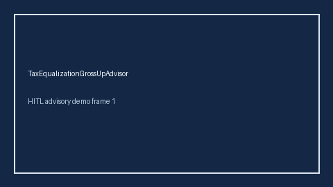

# TaxEqualizationGrossUpAdvisor Guide



Offline HITL advisor. Never auto-acts. Closes closed-UI gaps vs Mercer/PwC/Levels.fyi tax-equalization / gross-up planners.

Optional later polish via **GPT-5.5 / Claude Sonnet 4.6 / Gemini 3.x / Kimi K2**.

Distinct from `RelocationPackageGapAdvisor` and `RemoteWorkStipendTaxGapAdvisor`.

## Usage

```python
from autoapply_agent.services.tax_equalization_gross_up import TaxEqualizationGrossUpAdvisor

report = TaxEqualizationGrossUpAdvisor().advise(
    gross_up_usd=10.0,
    tax_delta_usd=7.0,
)
assert report.auto_enroll is False
print(report.coverage_band)
```

## Safety

Always `requires_human_review=True`. No HTTP. Humans decide. See `SAFETY.md`.
