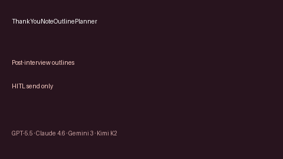

# Thank-You Note Outline Planner Guide



Build deterministic, offline **post-interview thank-you note outlines** for
email or LinkedIn. Never auto-sends. Closes the gap vs Teal/Huntr / Careerflow
templates that encourage one-click outreach from closed UIs.

Optional later polish via **GPT-5.5 / Claude Sonnet 4.6 / Gemini 3.x / Kimi K2**.
The outline structure itself stays deterministic.

## Why this exists

Most job trackers ship thank-you templates, but few open-source career agents
expose a local outline planner that always requires human review before send.
This service sets `requires_human_review=True`, keeps `auto_send=False`, and
performs no network I/O.

## Usage

```python
from autoapply_agent.services.thank_you_outline import ThankYouNoteOutlinePlanner

outline = ThankYouNoteOutlinePlanner().plan(
    company="Acme",
    role="Platform Engineer",
    interviewer="Alex Kim",
    highlights=["kafka lag dashboards", "on-call culture"],
    channel="email",
)
assert outline.requires_human_review is True
assert outline.auto_send is False
print(outline.subject)
print(outline.beats)
```

Channels: `email`, `linkedin`.

## Safety

Always `requires_human_review=True` and `auto_send=False`. No HTTP. Humans
edit and send manually. See `SAFETY.md`.
