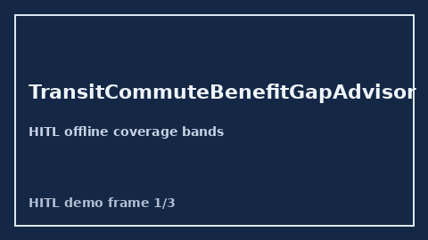

# TransitCommuteBenefitGapAdvisor Guide



Offline HITL advisor. Never auto-acts. Closes closed-UI gaps vs WageWorks/CommuterBenefits/TransitChek/Levels.fyi transit-benefit planners.

Optional later polish via **GPT-5.5 / Claude Sonnet 4.6 / Gemini 3.x / Kimi K2**.

Distinct from `CommuteCostTradeoffAdvisor` and `HomeOfficeStipendGapAdvisor`.

## Usage

```python
from autoapply_agent.services.transit_commute_benefit_gap import TransitCommuteBenefitGapAdvisor

report = TransitCommuteBenefitGapAdvisor().advise(
    monthly_transit_need_usd=1800.0,
    employer_transit_benefit_usd=1200.0,
    planned_claim_usd=1200.0,
)
assert report.auto_claim is False
assert report.requires_human_review is True
print(report.coverage_band, report.remaining_cap_usd)
```

## Safety

Always `requires_human_review=True`. No HTTP. Humans decide. See `SAFETY.md`.
