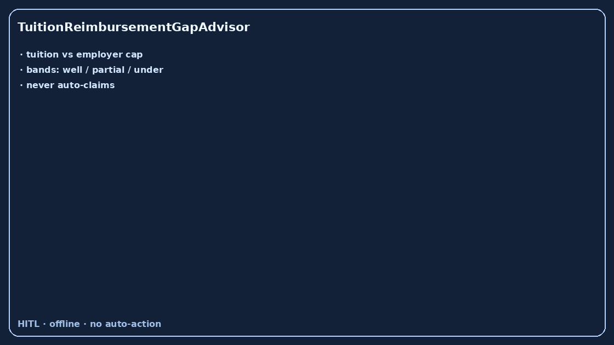

# TuitionReimbursementGapAdvisor Guide



Offline HITL advisor. Never auto-claims. Closes closed-UI gaps vs Levels.fyi /
Blind / Candor tuition and learning-budget planners.

Optional later polish via **GPT-5.5 / Claude Sonnet 4.6 / Gemini 3.x / Kimi K2**.

Distinct from `SkillGapLearningAdvisor` and `HomeOfficeStipendGapAdvisor`.

## Usage

```python
from autoapply_agent.services.tuition_reimbursement_gap import TuitionReimbursementGapAdvisor

report = TuitionReimbursementGapAdvisor().advise(
    annual_tuition_usd=10000.0,
    employer_cap_usd=5250.0,
    planned_claim_usd=5250.0,
)
assert report.auto_claim is False
assert report.requires_human_review is True
print(report.coverage_band, report.remaining_cap_usd)
```

## Safety

Always `requires_human_review=True`. No HTTP. Humans decide. See `SAFETY.md`.
