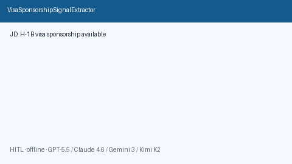

# Visa Sponsorship Signal Extractor Guide



Extract deterministic, offline **visa / work-authorization cues** from job
descriptions for HITL review. Never auto-applies. Closes the gap vs Simplify /
Teal / LinkedEasyApply filters that hide sponsorship signals behind login walls.

Optional later polish via **GPT-5.5 / Claude Sonnet 4.6 / Gemini 3.x / Kimi K2**.
Extraction itself stays deterministic.

Distinct from `JdCultureSignalExtractor` (culture/pace cues) and
`LocationRemoteFitScorer` (geo/remote policy).

## Usage

```python
from autoapply_agent.services.visa_sponsorship import VisaSponsorshipSignalExtractor

report = VisaSponsorshipSignalExtractor().extract(
    company="Acme",
    role="Backend Engineer",
    jd_text="Visa sponsorship available for H-1B. Cap-exempt transfers welcome.",
)
assert report.requires_human_review is True
assert report.auto_apply is False
print([s.signal for s in report.signals])
```

## Safety

Always `requires_human_review=True` and `auto_apply=False`. No HTTP. Humans
confirm sponsorship policy with recruiters before investing time. See `SAFETY.md`.
