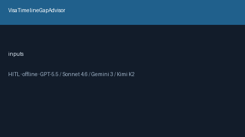

# VisaTimelineGapAdvisor Guide



Offline HITL advisor. Never auto-acts. Closes closed-UI gaps vs MyVisaJobs/Levels.fyi/Boundless visa timeline planners.

Optional later polish via **GPT-5.5 / Claude Sonnet 4.6 / Gemini 3.x / Kimi K2**.

Distinct from `VisaSponsorshipSignalExtractor and NoticePeriodConflictFlagger`.

## Usage

```python
from autoapply_agent.services.visa_timeline_gap import VisaTimelineGapAdvisor

report = VisaTimelineGapAdvisor().advise(
    days_to_start=90.0,
    estimated_processing_days=60.0,
    buffer_days=14.0,
)
assert report.auto_enroll is False
assert report.requires_human_review is True
print(report.coverage_band)
```

## Safety

Always `requires_human_review=True`. No HTTP. Humans decide. See `SAFETY.md`.
