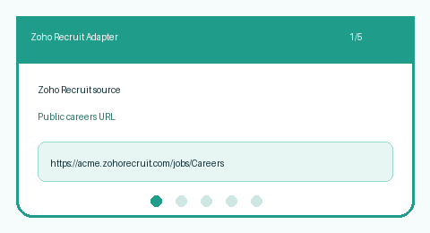

# Zoho Recruit Source Guide



Use this guide when wiring a public Zoho Recruit careers board into
**agentic-career-search**. Discovery is deterministic HTML URL-shape matching —
enrichment with GPT-5.5 / Claude Sonnet 4.6 / Gemini 2.5 / Kimi K2 is optional
and runs after candidates are collected.

## Why Zoho Recruit

Zoho Recruit is common across small and mid-market career sites and is often
published from `*.zohorecruit.com` or a vanity-domain proxy. Unlike Greenhouse
boards, postings are linked by job ids in query strings or path segments rather
than a single CSS class. This adapter mirrors the SuccessFactors/Taleo approach
used by enterprise ATS scrapers.

## Register a source

```bash
curl -X POST localhost:8000/source-configs \
  -H 'content-type: application/json' \
  -d '{
    "name": "acme-zoho-recruit",
    "source_type": "zoho_recruit",
    "base_url": "https://acme.zohorecruit.com/jobs/Careers"
  }'
```

Any public listing URL works. The adapter extracts postings from:

| Shape | Example |
|---|---|
| Query `jobId` | `/jobs/Careers?jobId=ZR-1234` |
| Query `jid` | `/jobs/Careers?jid=ZR_7788` |
| Query `job_id` | `/jobs/Careers?job_id=9001` |
| Path `/jobs/{id}` | `/jobs/ABCD99` |
| Path `/job/{id}` | `/job/ABC-42` |
| Path `/careers/{id}` | `/careers/ZR-5555` |
| Path `/Jobs/Careers/{id}` | `/Jobs/Careers/ZR-9999` |

Apply steps (`mode=apply`, `source=apply`, trailing `apply`/`login`) are
ignored.

## What you get

| Field | Source |
|---|---|
| `title` | Anchor text, else `title` attribute |
| `location` | Nearest posting-container location text |
| `external_id` | `jobId` / `jid` / `job_id` query value or terminal path id |
| `url` | Absolute posting URL |
| `company` | Host-derived token |

## Safety notes

- Public careers pages only — no authenticated Zoho Recruit APIs.
- Outbound User-Agent comes from settings.
- Parsing stops at `max_jobs`; no unbounded crawl.

See ADR-092 for the design decision.
